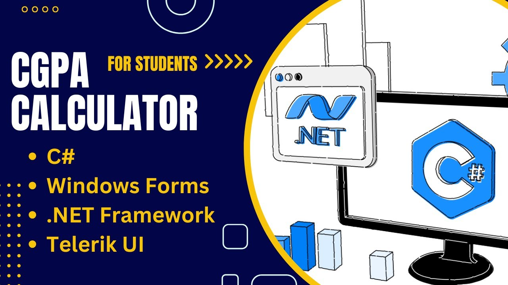

# CGPA Calculator for Students
## Demo Video

## Description

The CGPA Calculator is a desktop application developed using Windows Forms, .NET Framework, and Telerik UI for WinForms. This application assists students in tracking their CGPA and generating detailed PDF reports. It is specifically designed for Sri Lankan students, utilizing a grading scale that aligns with the Sri Lankan academic system.

## Key Features

- **Track CGPA**: Add courses, input results, and view comprehensive statistics, including semester-wise GPA.
- **Export Reports**: Generate and export detailed PDF reports.
- **Sort and Filter**: Easily sort and filter courses.
- **Search Functionality**: Quickly search for specific courses.
- **Offline Usage**: Fully functional offline.
- **Visual Representation**: Bar chart view to visually represent CGPA semester-wise.
- **Set Target GPA**: Set and track your target GPA.
- **Multiple Themes**: Available in four different themes - ControlDefault, Dark, Light, and Telerik.

## Installation

In the repository, you will find four folders for the different themes:

- ControlDefault Theme
- Dark Theme
- Light Theme
- Telerik Theme

### Download and Run the Installer

You can install the application using either `setup.exe` or `CGPA_Calculator.msi`.

#### Using `setup.exe`

1. Download the installer from the repository.
2. Double-click `setup.exe`.
3. Follow the installation prompts.

#### Using `CGPA_Calculator.msi`

1. Download the installer from the repository.
2. Double-click `CGPA_Calculator.msi`.
3. Follow the installation prompts.

## Usage

1. Run the application.
2. Track your CGPA and enjoy.
3. If you want a different theme, uninstall the current version and try another theme.

## Screenshots

Screenshots of the application in various themes can be found in the `Screenshots` folder:

- ControlDefault 1.png
- ControlDefault 2.png
- ControlDefault 3.png
- Dark 1.png
- Dark 2.png
- Dark 3.png
- Light 1.png
- Light 2.png
- Light 3.png
- Telerik 1.png
- Telerik 2.png
- Telerik 3.png

## Demo Videos

Demo videos demonstrating various features of the application can be found in the `Demo Videos` folder:

- CGPA Calculator Demo 1 (ControlDefault Theme).mp4
- CGPA Calculator Demo 2 (Light Theme & Installation).mp4
- CGPA Calculator Demo 3 (PDF Export).mp4
- CGPA Calculator Demo 4 (Telerik Theme).mp4
- CGPA Calculator Demo 5 (Dark Theme).mp4

## Feedback

If you encounter any issues or have feedback, feel free to reach out. Your feedback is always welcomed.

## Acknowledgements

Through this project, I have gained valuable knowledge in C# OOP, desktop application development, and publishing using the .NET Framework. I hope this project helps address the real-life need for efficient CGPA tracking for Sri Lankan students.
